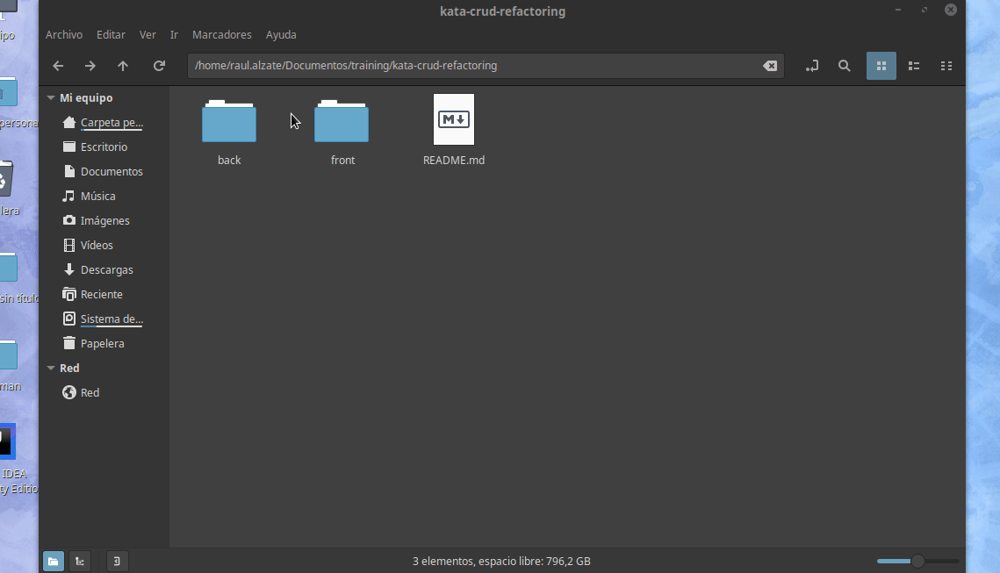

# Reto FullStack CRUD

Refactorización de proyecto [kata-crud-refactoring](https://github.com/Sofka-XT/kata-crud-refactoring)

Se tiene presente un formulario donde se registra unas tareas basadas en una lista por hacer. Esta lista se crea para poder tener una grupos de items donde se pueda gestionar un CRUD.

## Video explicativo
https://user-images.githubusercontent.com/64755135/167281554-dacf411e-665c-4fc4-8401-560cf1ea39f1.mp4

## KATA Full Stack
En el siguiente proyecto se presenta algunos conceptos de Full Stack, trabajando con Spring Boot + ReactJS.

#### Demo

### Instalación

